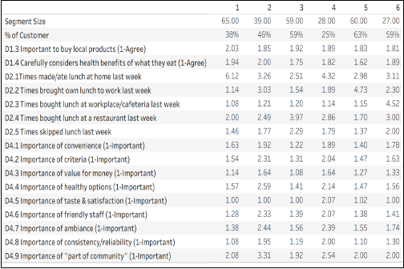

# Sticks Kebob Shop: Segmentation, Targeting & Positioning

A survey-based segmentation study for a Mediterranean quick-service restaurant chain deciding **which markets to enter and where to put its next locations**.

**Method:** k-means cluster analysis in R · segment profiling and visualisation in Tableau
**Deliverable:** target-segment recommendation and positioning strategy, presented as a client-facing deck

---

## The business question

Sticks Kebob Shop (founded 2001, Charlottesville VA) sits in the fast-growing ethnic QSR segment. Its expansion decisions turned on two questions:

1. Which customer segments should it target?
2. What do those segments look like demographically, so the chain can pick locations that contain them?

## Approach

**Segmentation bases — what defines a segment.** Three behavioural blocks, chosen because each maps to something Sticks can act on:

| Block | Variables | Why |
|---|---|---|
| Diner preferences | Preference for local products; attention to health benefits | Matches Sticks' local, health-forward positioning |
| Core lunch behaviour | Lunches eaten at home, brought from home, bought at the workplace, bought at a restaurant, skipped | Sticks competes for the weekday lunch occasion against Panera and Chipotle |
| Restaurant selection criteria | Convenience, variety, value, healthy options, taste, friendly staff, ambiance, consistency, community | Nine attributes covering what makes someone choose one lunch spot over another |

**Descriptors — how to find a segment in the real world.** Gender, age, household income, household type, children by age, children's activities, and existing-customer status. These are the variables a location decision can actually be made on.

**Cluster count.** An elbow plot on the base variables gave **six segments**.


## The segment profile

All six segments across all sixteen base variables. Lower scores mean *more* important, since the survey scales run from 1 = strongly agree / very important.




**Segment 3 — primary target.** The heaviest restaurant-lunch buyers in the sample (3.97 on restaurant lunches against 2.51 on home-made, the highest and lowest in the set). Their stated priorities line up almost exactly with Sticks' value proposition: convenience, value for money, healthy options, friendly staff.

**Segment 5 — secondary target.** Cost- and health-conscious, and the segment most likely to bring lunch from home. That makes it a *conversion* opportunity rather than a share-of-wallet one: the pitch is a fresh-made meal competing with what they would have packed.

## Why these two

Segments 3 and 5 are the only ones that combine **size** with **proven affinity**. At 59 and 60 respondents they are among the largest segments, and 59% and 63% of their members are already Sticks customers — the highest concentrations in the study. Segment 1 is slightly larger at 65 respondents, but only 38% of it buys from Sticks today.


Two further checks confirmed the pick against what the founders already believed:


Segments 3 and 5 hold the highest concentration of business professionals, matching the weekday-lunch base Sticks was built around. Yet those customers buy a workplace-area lunch only about once a week, so the occasion is under-served rather than saturated.


Segment 5 has the highest share of households with children in soccer, giving the founders' "active family" intuition an evidence base rather than an anecdote.

## What the targets look like


Target customers concentrate in the under-$50K and $50K–$100K brackets. High-income households are *under*-represented among them, which says Sticks' natural appeal is value-driven rather than premium — a real constraint on both pricing and site selection.


Behaviourally, targets buy restaurant lunch 2.8 times a week against 2.4 for everyone else, eat at home far less (2.7 vs 4.6), and rely less on workplace cafeterias (1.2 vs 1.7). They are already out at lunch. The only question is where they go.

## The recommendation

Position Sticks as **the default lunch for busy professionals who want to eat healthily**, and weight site selection toward locations dense in Segment 3 and Segment 5 households.

## Repository contents

```
├── code/    Sticks Segments - Hanyu.r      # clustering and segment profiling
├── plot/    01–09 *.png                    # segment profile and descriptor charts
│            *.twb / *.twbx                 # Tableau workbooks behind the charts
├── report/  final deck                     # full analysis and recommendation
└── README.md
```

## Context

Course project for **MKT / marketing analytics**, UBC Sauder MBA, 2026.

**My contribution:** I defined the analytical approach and wrote the analysis code. Each of the six team members developed an independent approach and codebase and the group selected one to carry forward; mine was the version taken to submission. Slide production was divided across the team.

## Data and sources

Built on survey data supplied with the *Sticks Kebob Shop* teaching case (Ivey Publishing). The case materials and the respondent-level dataset are copyright of their publisher and are **not** redistributed in this repository — only the analysis code, figures, and conclusions, which are the authors' own work.
